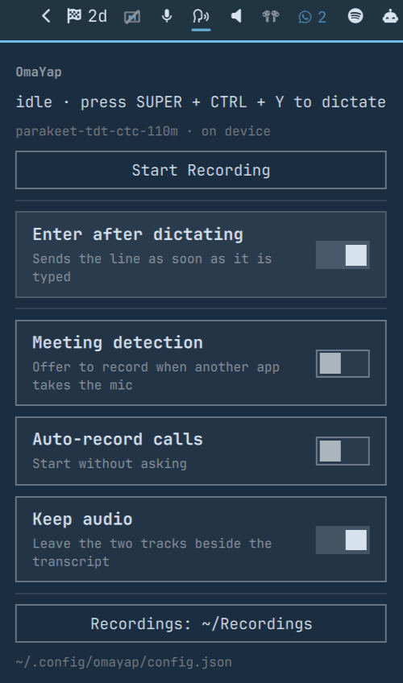

# OmaYap

Hold a key, talk, let go, and the words appear where your cursor is. Record a
meeting and get both sides of it as a transcript. All on this machine, with one
126 MB speech model and no accounts.

A port of [yap](https://github.com/TerrifiedBug/yap)'s core to Omarchy. It
replaces voxtype.



## What it does

Dictation: press your key, speak, press again. The text is typed into whatever
window had focus, or copied to the clipboard if nothing will take keystrokes. A
press shorter than 0.3 s is ignored.

Meetings: your microphone and everything the speakers play, recorded as two
tracks and transcribed as `me` and `them`. When another app takes the
microphone, omayap offers to record it, or starts on its own if you let it.

While either is running you get a card at the bottom of the screen: an 8-bit
level meter, a clock, and a stop button. Adapted from
[omakoe](https://github.com/ok/omakoe).

The model stays in memory, so a press costs a decode. On an Intel Core Ultra
X7 358H, `omayap bench` on the model's own 7.4 s sample: p50 62 ms, 119x
realtime. The daemon sits at about 240 MB of RSS, settling near 300 MB once
the decoder's arena has grown, and a meeting transcription adds a second
short-lived process of its own.

## Install

Needs Omarchy 4.x, PipeWire, `python3`, and about 185 MB of disk for the venv
and the models. `pw-record`,
`wtype`, `wl-copy`, `pactl`, `pw-dump`, `hyprctl` and `setpriv` all ship with
Omarchy.

```bash
omarchy plugin add https://github.com/TerrifiedBug/omayap.git --enable
~/.config/omarchy/plugins/io.github.terrifiedbug.omayap/setup.sh
```

`omarchy plugin add` only clones the repo, so `setup.sh` is yours to run. It
builds a venv, downloads the Parakeet and Silero models against pinned SHA-256
checksums, writes `~/.config/omayap/config.json`, links `~/.local/bin/omayap`,
and enables `omayap.service` for your graphical session.

Then bind a key in `~/.config/hypr/bindings.lua` and run `hyprctl reload`:

```lua
o.bind("SUPER + CTRL + Y", "Toggle dictation", "~/.local/bin/omayap toggle", { release = true })
```

Bind on release. The transcript is typed by a virtual keyboard, and a modifier
you are still holding merges into every letter, so `hello` becomes five
`SUPER + CTRL` shortcuts. Push-to-talk needs a key of its own because it binds
both a press and a release:

```lua
o.bind("F10", "Start dictation (push-to-talk)", "~/.local/bin/omayap press")
o.bind("F10", "Stop dictation (push-to-talk)", "~/.local/bin/omayap release", { release = true })
```

If you run omakoe, remove it: `omarchy plugin remove io.github.ok.omakoe`. Its
HUD is built in here.

### voxtype already holds F9 and SUPER + CTRL + X

Omarchy's `bindings/voxtype.lua` takes both keys while the `voxtype` binary is
on `PATH`, and a second bind on the same key does not replace the first, so
give omayap a key of its own as above. Both systems then work and you pick
which key you reach for.

If you would rather have F9 back, `omarchy-voxtype-remove` is Omarchy's own
command for it. That uninstalls voxtype along with its config and models, so it
is a decision rather than a step in an install. Disabling `voxtype.service`
does not free the keys: the bindings only disappear with the binary.

## Settings

`~/.config/omayap/config.json`. The panel toggles write to it, and the next
press reads the file.

| Key | Default | Meaning |
| --- | --- | --- |
| `recordings_dir` | `~/Recordings` | Where sessions go |
| `keep_audio` | `true` | Keep the two tracks beside the transcript. 3.8 MB a minute per track |
| `newline_after_dictation` | `false` | Press Enter once the text is typed |
| `meeting_detection` | `false` | Watch for another app taking the microphone |
| `meeting_auto_record` | `false` | Start recording without asking |
| `meeting_excluded_apps` | `[]` | Names to ignore, matched against the stream name and the binary |

Meeting detection is event-driven: it reads `pactl subscribe`, debounces 2 s,
then checks `pw-dump` once and finds the window with `hyprctl clients`. A call
is not declared over until capture has been gone for 16 s.

## A session

```
~/Recordings/2026.01.02-0930-Team Standup/
  meta.json  transcript.md  transcript.json
  mic.f32  system.f32       # only with keep_audio
  transcribe.log
```

```markdown
# 2026.01.02-0930-Team Standup

engine: parakeet (parakeet-tdt-ctc-110m)

**[0:02] me:** Morning, can you hear me?

**[0:05] them:** Loud and clear.
```

The directory is named for the local time the recording started, plus the
window title when detection found one. `meta.json` carries the start and end in
UTC, the duration, and how far apart the two tracks started.

## The CLI

`omayap` is what the keybindings and the panel call, and it is the whole API.

```bash
omayap toggle         # start dictating, or stop and transcribe
omayap press          # push-to-talk down (one signal, no Python)
omayap release        # push-to-talk up
omayap record         # start a meeting recording, or stop the running one
omayap status         # the daemon's state, as JSON
omayap config KEY VAL # write one setting
omayap bench FILE.wav # time the model on 16 kHz mono audio
```

The daemon has no socket. Everything arrives as a signal, so the hot path never
starts an interpreter, and the QML side reads one state file in
`$XDG_RUNTIME_DIR/omayap/` and runs the same CLI the keys do.

## What is stored, and where

Runs as you, in your user session. Nothing in this plugin asks for `sudo`, and
neither `setup.sh` nor `uninstall.sh` writes outside your home directory. One
user service, stopped with your graphical session. No network at runtime.

| What | Where | Contains |
| --- | --- | --- |
| Transcripts | `recordings_dir/<session>/transcript.{md,json}` | every word said |
| Audio | same directory, `mic.f32` and `system.f32` | the recording, unless `keep_audio` is off |
| Meeting metadata | same directory, `meta.json` | app name and window title, when detection found one |
| Directory names | `recordings_dir` | the window title, which is the point of them |
| Daemon log | `journalctl --user -u omayap` | timing, counts, app names, errors. No words, titles or paths |
| Live state | `$XDG_RUNTIME_DIR/omayap/state` | the current session's path, until reboot |

Notifications show a meeting title while a call is being offered or recorded.

## Troubleshooting

```bash
systemctl --user status omayap
journalctl --user -u omayap -n 50
omayap status
```

"daemon is not running": `systemctl --user start omayap`. "model still
loading": the first half second after the service starts. Nothing typed: the
focused surface would not take keystrokes and the text is on your clipboard.
Key does nothing: check `hyprctl binds` for a second bind on it. A recording
with no transcript: read `transcribe.log` in the session directory, and the
daemon retries untranscribed sessions when it next starts.

Editing the plugin's QML needs `omarchy-restart-shell`; a hot reload keeps the
cached widget component.

## Uninstall

Before `omarchy plugin remove`, while the scripts are still on disk:

```bash
cd ~/.config/omarchy/plugins/io.github.terrifiedbug.omayap
./uninstall.sh    # add --purge to delete the venv and the models too
cd ~ && omarchy plugin remove io.github.terrifiedbug.omayap
```

Then delete omayap's binds and run `hyprctl reload`. Your recordings are never
touched.

## Credits and licence

MIT. See `LICENSE` and `NOTICE`.

`Hud.qml`, `PixelMorph.qml`, `Scanner.qml` and `HudModel.js` are adapted from
[omakoe](https://github.com/ok/omakoe), copyright (c) 2026 Oliver Kohl, MIT.
Speech recognition uses [sherpa-onnx](https://github.com/k2-fsa/sherpa-onnx)
with the Parakeet TDT CTC 110M and Silero VAD models it publishes; `setup.sh`
downloads those and they are not part of this repository.
